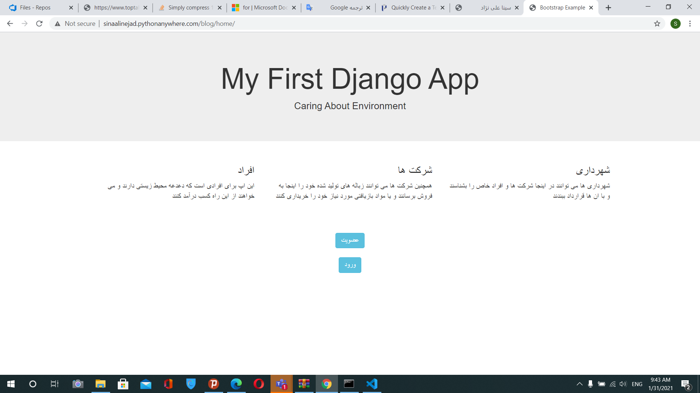

## my image

 
 
 
 

[link to my app](http://sinaalinejad.pythonanywhere.com/blog/home/)

سلام

(http://sinaalinejad.pythonanywhere.com/blog/home/)

---

پروژه من با جنگو ، یکی از فریم ورک های پایتون زده شد. هم فرانت اند و هم بک اند کار کردم.در این اپ قابلیت هایی برای استفاده بهینه از بازیافت گنجانده شده و افراد و شرکت ها می توانند به خرید و فروش بازیافت بپردازند.

**Test**: here is the posts
